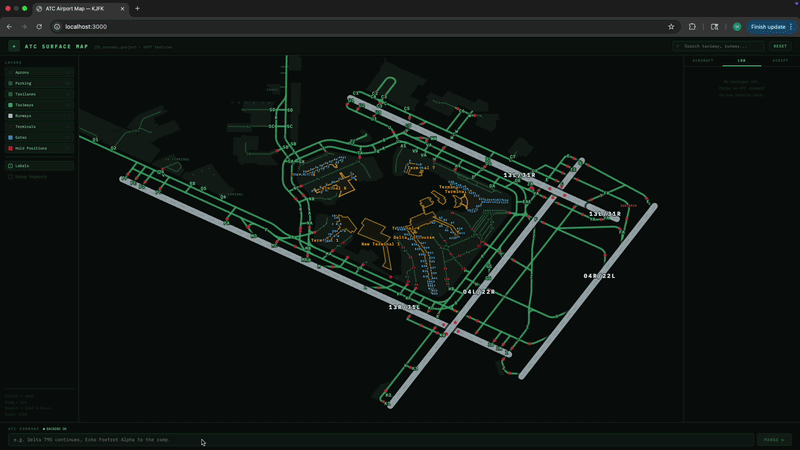
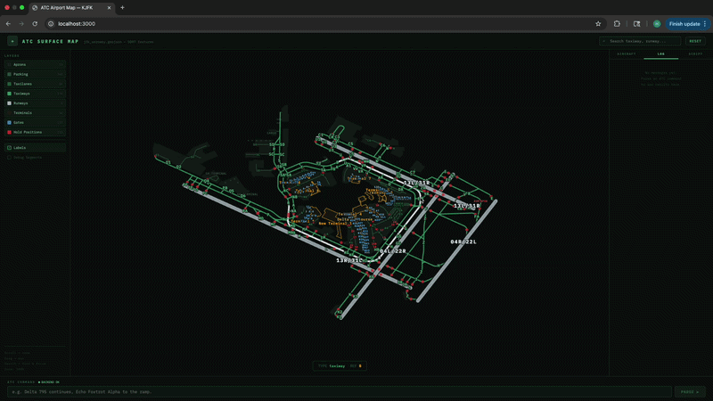

# ATC Airport Surface Map

An interactive airport ground map that parses Air Traffic Control (ATC) transcripts and highlights aircraft taxi routes in real time. Load any airport's GeoJSON, type an ATC instruction, and watch the route resolve itself geometrically on the map.

---

## Overview

When an aircraft lands and receives taxi instructions, ATC often uses phonetic taxiway names in sequence — e.g. *"Echo Foxtrot Alpha to the ramp."* The challenge is that spoken letters might refer to individual taxiways (`E`, `F`, `A`) **or** compound designators (`FA`, `EF`) depending on the airport layout.

This tool solves that ambiguity using **geometric intersection validation**: it generates every possible grouping of the spoken letters into valid taxiway names, then checks which grouping has consecutive taxiways that actually touch each other in the GeoJSON geometry. The winning grouping is highlighted on the map.

---

## Features

- **ATC transcript parsing** via Llama 3 70B (HuggingFace Inference API)
- **Route disambiguation** using Shapely geometry — compound taxiway names are resolved automatically
- **Runway context awareness** — landing runway is remembered across commands, biasing route resolution toward taxiways that touch that runway
- **Per-callsign aircraft state** — each aircraft's route history is tracked so consecutive commands build on each other correctly
- **Colored path rendering**:
  - 🔴 Red — runway (from landing threshold to exit point)
  - 🟠 Orange — current taxi route
  - 🟡 Yellow — previously cleared route history
  - 🟣 Purple - Path found by BFS to connect broken paths
  - ⬜ Grey — unrelated segments restored to base appearance
- **BFS propose taxiway** — Sometimes the ATC doesn't give the fully connected path, and the BFS proposes the shortest taxiway to connect the broken path, limited upto 2 addition taxiway.
- **Partial segment coloring** — only the traversed portion of each taxiway is highlighted, not the entire taxiway geometry
- **Interactive SVG map** — pan, zoom, hover tooltips, layer toggles, label display, and a debug mode that shows per-segment coloring with feature indices
- **GeoJSON upload** — drag-and-drop or click to load any airport's aeroway GeoJSON
- **Debug mode** — visualizes exactly which GeoJSON feature indices are being colored and at what coordinates

---

## Architecture

```
atc-map/
├── backend/
│   ├── server.py           # FastAPI backend — geometry engine + LLM parsing
│   └── requirements.txt
├── src/
│   ├── App.jsx             # React frontend — SVG map + ATC command panel
│   └── main.jsx
├── index.html
├── package.json            # Vite + React
└── vite.config.js
```

The backend and frontend run as separate processes communicating over HTTP on localhost.

---

## Quick Start

### 1. Backend (Python 3.10+)

```bash
cd atc-map/backend
pip install -r requirements.txt

export HF_TOKEN="your-huggingface-token"

# Option B: start empty, upload via frontend drag-and-drop
python server.py
```

The backend runs at `http://localhost:8000`.

A HuggingFace token with access to `meta-llama/Llama-3-70b-chat-hf` is required for ATC parsing. You can get one at [huggingface.co/settings/tokens](https://huggingface.co/settings/tokens).

### 2. Frontend (Node 18+)

```bash
cd atc-map
npm install
npm run dev
```

The frontend runs at `http://localhost:3000` (or the port Vite assigns).

### 3. Use It

1. Drop a `.geojson` file onto the browser window (it auto-uploads to the backend)
2. Type an ATC instruction in the bottom panel
3. Press **PARSE** (or Enter) — the route resolves and highlights on the map
4. Issue follow-up commands for the same callsign — the tool remembers where the aircraft is

---

## Getting Airport GeoJSON

Use [OSMnx](https://osmnx.readthedocs.io/) to export airport aeroway features from OpenStreetMap:

```python
import osmnx as ox

features = ox.features_from_place(
    "John F. Kennedy International Airport",
    tags={"aeroway": True}
)
features.to_file("jfk_aeroway.geojson", driver="GeoJSON")
```

Any GeoJSON `FeatureCollection` with `aeroway` properties (`taxiway`, `taxilane`, `runway`, `apron`, etc.) and `ref` tags will work.

---

## How Route Resolution Works

Given the ATC instruction *"Echo Foxtrot Alpha"*, the backend:

0. Utilize info from `.geojson` to determine which taxiway is available for which runway to exit, and what are the neighbors for each taxiway
1. **Parses** with Llama 3 70B: extracts `route_raw = ["E", "F", "A"]` (each phonetic letter separately)
2. **Generates groupings** — all ways to combine the letters into valid taxiway refs at this airport:
   - `["E", "F", "A"]` — three taxiways
   - `["E", "FA"]` — taxiway E + compound FA
   - `["EF", "A"]` — compound EF + taxiway A (only if EF exists in the GeoJSON)
3. **Checks connectivity** — for each grouping, verifies that consecutive taxiways geometrically intersect using buffered Shapely geometries (~15m tolerance for OSM data gaps)
4. If the ATC commands cannot fully connect, use **BFS** to find the shortest path to connect the broken taxiway commands (maximum 2 additional taxiway can be used)
5. **Selects the winner** — prefers connected groupings, then biases toward the grouping whose first taxiway touches the known landing runway
6. **Builds colored segments** — computes entry and exit points on each taxiway using intersection centroids, then slices the original GeoJSON coordinates to color only the traversed portion

---

## Example

The server parse out the following ATC commands and show the path.

1. Delta 795, heavy Kennedy Tower, hello, number 3 behind company, wind 10020, gust 28, runway 13L, clear to land.
2. Delta 795 Heavy, exit via Zulu Alpha at Foxtrot, join Alpha, and then monitor 1219.
3. Delta 795 Heavy continues, Echo Foxtrot Alpha to the ramp.



It can also deal with multiple aircrafts.

1. Delta 795, heavy Kennedy Tower, hello, number 3 behind company, wind 10020, gust 28, runway 13L, clear to land.
2. Tango Lima Heavy Kennedy Tower, hello, number 4 behind the heavy airbus, caution the wake terminal, 7100 at 19, gust 28, runway 13L, cleared to land.
3. Delta 795 Heavy, exit via Zulu Alpha at Foxtrot, join Alpha, and then monitor 1219.
4. Tango Lima Heavy, exit to the right at Delta Bravo, then turn left onto Alpha.
5. Delta 795 Heavy continues, Echo Foxtrot Alpha to the ramp.



---

## Future Works

- ~~Maybe deal with left turn and right turn for the last taxiway, so that it does not need to light the full taxiway up~~ [Solved on Apr 17]
- Deal with different call signs, sometimes the ATC and pilot respond with abbreviated call signs such as Delta 795 heavy, Delta 795, 795 all means the same aircraft
- Confirm the response from the pilot is saying the same thing as the ATC command
- Deal with all recordings, not all are commands, sometimes its asking for the info or ATC commands give suggestions for the pilot to make decision, or pilots fails to follow the instructions and ask for new commands.
- ULTIMATE GOAL!!! Connect to ATC livestream, but its going to be a huge challenge, because the transcribe is not very precise

---

<!-- ## API Reference

All endpoints accept/return JSON. The backend must have a GeoJSON loaded (via `/load-geojson` or `GEOJSON_PATH`) before route-related endpoints will work.

| Method | Endpoint | Description |
|--------|----------|-------------|
| `GET` | `/` | Health check — returns airport load status and taxiway count |
| `POST` | `/load-geojson` | Upload a GeoJSON file (multipart form data) |
| `POST` | `/load-geojson-path` | Load GeoJSON from a local server path |
| `POST` | `/parse` | Full pipeline: parse ATC transcript → resolve route → return colored segments |
| `POST` | `/resolve-route` | Resolve route directly from letter array, no LLM (e.g. `["Z","A"]?runway=13L`) |
| `GET` | `/intersections` | All pre-computed taxiway intersection pairs and their coordinates |
| `GET` | `/taxiways` | All taxiway refs and their connected neighbors |
| `GET` | `/aircraft-state` | Current state for all tracked callsigns |
| `GET` | `/aircraft-state/{callsign}` | State for a specific callsign |
| `GET` | `/intersections` | Return all pre-computed taxiway intersections |
| `GET` | `/taxiways` | Return all taxiway refs and which others they intersects |
| `GET` | `/runway-entry-taxiways` | Return the directional runway entry index: for each landing direction, which taxiway refs can be directly entered from that runway end based on geometric direction analysis |
| `GET` | `/taxiway-connections` | Return genuine taxiway-to-taxiway connections, with runway phantom intersections removed |
| `DELETE` | `/aircraft-state/{callsign}` | Clear state for a callsign (e.g. after pushback) |

### `/parse` request body

```json
{ "transcript": "Delta 795 continues, Echo Foxtrot Alpha to the ramp." }
```

### `/parse` response (abbreviated)

```json
{
  "parsed": {
    "callsign": "DAL795",
    "instruction_type": "taxi_route",
    "route_raw": ["E", "F", "A"],
    "runway": null,
    "summary": "Delta 795 to continue via Echo, Foxtrot, Alpha to the ramp"
  },
  "route": {
    "resolved_route": ["E", "FA"],
    "method": "intersection_validated",
    "intersections": [{ "from": "E", "to": "FA", "point": [-73.781, 40.643] }],
    "origin_runway": "13L"
  },
  "colored_segments": [
    { "ref": "E", "aeroway": "taxiway", "color": "orange", "feat_idx": 0, "coords": [[...]] },
    ...
  ],
  "aircraft_state": { "runway": "13L", "last_taxiway": "FA", ... }
}
```

---

## Configuration

| Environment variable | Default | Description |
|---|---|---|
| `HF_TOKEN` | *(required)* | HuggingFace API token for Llama 3 70B inference |
| `GEOJSON_PATH` | *(none)* | Path to a GeoJSON file to load automatically on startup |

The frontend hardcodes `http://localhost:8000` as the backend URL. To change it, update `BACKEND_URL` in `src/App.jsx`. -->

---

## Development Notes

- **Geometry buffer tolerance** is set to `0.00015` degrees (~15 m). Increase this if taxiways that visually touch aren't resolving as connected in your GeoJSON.
- **Aircraft state is in-memory** — restarting the backend clears all tracked aircraft positions.
- The frontend **merges new colored segments** with existing ones on each parse, keyed by `aeroway:ref`. Sending a new command for a taxiway already on the map replaces its coloring.
- The **debug mode** (sidebar toggle) renders each colored segment as a labeled dashed line with start/end dots, making it easy to diagnose mismatched feature indices between the backend and frontend.

---

## Dependencies

**Backend**

| Package | Purpose |
|---|---|
| `fastapi` | HTTP API server |
| `uvicorn` | ASGI server |
| `shapely` | Geometric intersection checks and coordinate math |
| `huggingface_hub` | Llama 3 70B inference client |
| `python-multipart` | GeoJSON file upload parsing |

**Frontend**

| Package | Purpose |
|---|---|
| `react` / `react-dom` | UI rendering |
| `vite` | Dev server and build tool |
| `@vitejs/plugin-react` | JSX transform |